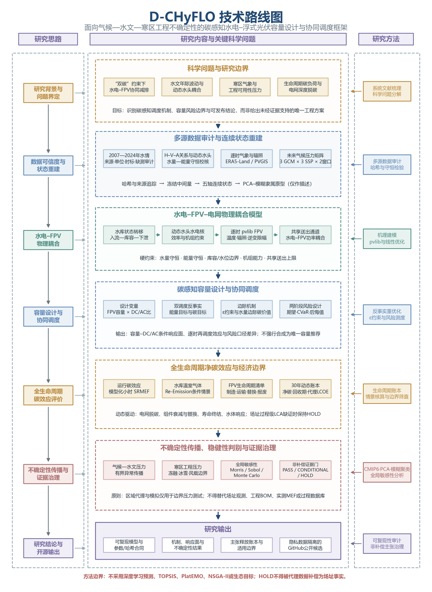

# D-CHyFLO

**面向气候—水文—寒区工程不确定性的碳感知水电–浮式光伏容量设计与协同调度框架**

[](https://github.com/DOI-SPY/D-CHyFLO/actions/workflows/ci.yml)
[](LICENSE)
[](pyproject.toml)

D-CHyFLO（Dynamic Carbon-aware Hydro–Floating Photovoltaic Lifecycle-Oriented framework）是一个机理驱动的科研软件原型，用于研究常规水库水电与浮式光伏（FPV）的容量响应、共享送出、碳感知调度、动态生命周期碳以及气候—水文—寒区压力边界。

本仓库是去场址化的 clean-room 公开版本。它不包含任何真实水库长系列水情、调度手册、工程曲线原件、受限数据库或可逆向重建的逐时/逐日运行结果。



## 研究问题

D-CHyFLO围绕八个问题组织模型与证据：

1. 水情、H–V–A关系、动态水头与水量守恒能否形成可信物理基线；
2. FPV容量和DC/AC设计如何影响送电、弃光与条件净碳；
3. 碳感知调度是否改变水资源时序价值；
4. 水库GHG与FPV生命周期负荷如何改变净碳和回收期；
5. 气候、水文和寒区压力是否改变历史设计的稳健性；
6. 连续水文状态能否替代粗粒度枯—平—丰标签；
7. 代理经济边界能否支持设计筛选；
8. 证据不完整时，哪些结论仍可条件发布。

## 模块

| 模块 | 公开实现 |
|---|---|
| 水库物理 | H–V–A单调插值、动态水头、水量守恒与历史调和 |
| FPV | 基于pvlib的逐时出力及参数化寒区可用率 |
| 协同调度 | Pyomo/HiGHS能量调度与碳感知词典序调度 |
| 边际水碳价值 | 月尺度水量扰动、重新优化和中心差分 |
| 生命周期碳 | 建设、替换、退役、性能衰减和电网脱碳的年度账本 |
| 水库GHG | 条件情景耦合、因子分解与归属边界诊断 |
| 不确定性 | 有界压力、容量插值和非概率集合汇总 |
| 证据治理 | 功能单位、无效运算和非补偿式声明边界 |

## 快速开始

```bash
python -m venv .venv
# Windows: .venv\Scripts\activate
# Linux/macOS: source .venv/bin/activate
python -m pip install --upgrade pip
python -m pip install -e ".[dev]"
pytest
python examples/synthetic_reservoir/run_demo.py
```

演示使用完全合成的水库曲线和情景数据，结果写入`demo_output/`。

## 当前可释放结论

研究案例的完整计算已覆盖物理基线、碳感知调度、条件水库GHG、30年动态生命周期、容量–DC/AC风险设计和全局不确定性。公开仓库只释放方法与有界结论：

- 碳感知调度与能量调度可在共享送出约束下产生不同的用水时序；
- 水的边际碳价值具有季节和水文依赖；
- 不同风险准则可选择不同容量与DC/AC设计，不存在风险偏好无关的唯一方案；
- 电网脱碳、生命周期强度和水库响应的联合压力可侵蚀甚至翻转净碳收益；
- 情景集合、CMIP6压力窗口和有界参数空间占比均不解释为发生概率。

这些结论不构成任何具体水库的容量推荐、工程安全认证、未来入流预测、实测电网边际排放或最终场址生命周期评价。

## 数据边界

公开仓库仅含合成样例。真实案例数据应通过用户自备适配器加载，并遵守原始数据许可。详见[数据可用性说明](docs/DATA_AVAILABILITY.md)。

## 方法选择

框架采用可解释的物理模型、确定性优化和有界不确定性分析；不使用深度学习入流预测、TOPSIS、PlatEMO、NSGA-II，也不设置生态优化目标。生态影响与工程安全必须由独立专业研究评价，不能由本框架的碳结果替代。

## 引用与许可

引用信息见[`CITATION.cff`](CITATION.cff)。代码采用Apache-2.0许可证。外部数据和第三方软件仍遵循各自条款，参见[第三方说明](docs/THIRD_PARTY_NOTICES.md)。
